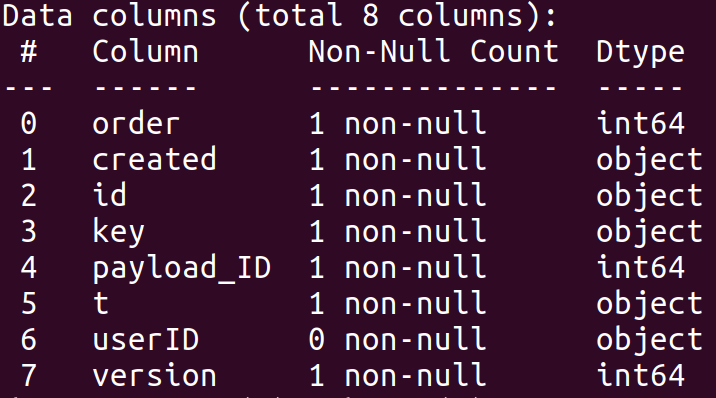
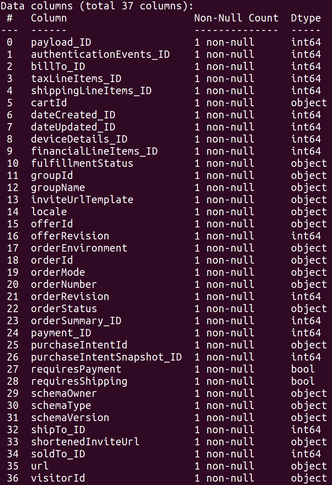
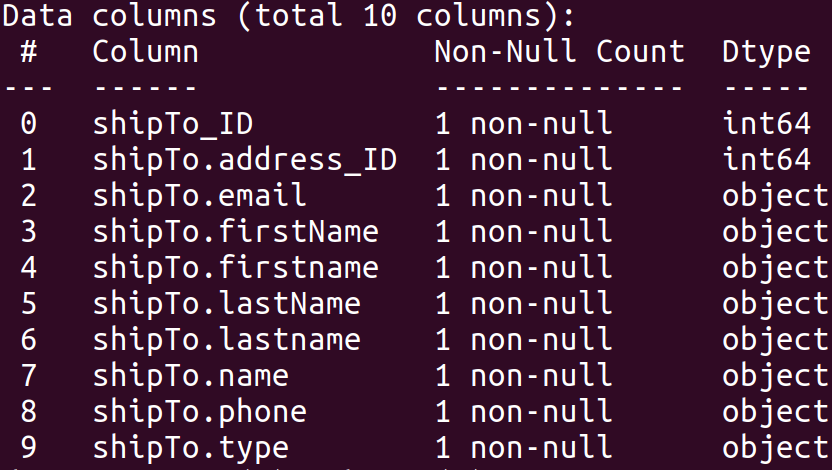

## Data Analyst Challenge - Andrew Lee

I used pandas dataframes to create normalized tables from the purchase example JSON file. I then created tables in postgresql and inputed the appropriate data to these tables.

## Examples of These DataFrames

### SQL Queries:

Below are my requested SQL Queries and their output.

When looking at the formatted prices, I noticed that the prices values were in cents. All revenue and costs were converted to dollars.                                     

### Revenue Per Day

~~~mysql
SELECT date_trunc('day',ord.created) AS Day, CONCAT('$',(CAST(SUM(comm.amount) AS float)/100)) AS RevPerDay
FROM public.order ord INNER JOIN (SELECT payload_id, com.amount
    FROM payload payl, (SELECT ordSum.ordersummary_id, total.amount
    FROM ordersummary ordSum INNER JOIN total ON (ordSum.total_id = total.total_id)) AS com
WHERE payl.ordersummary_id = com.ordersummary_id) AS comm ON (ord.payload_id = comm.payload_id)
GROUP BY date_trunc('day',ord.created)
ORDER BY 1 DESC;
~~~

Query Output:

<table style="width:100%">
    <tr>
        <th>day</th>
        <th>revperday</th>
    </tr>
    <tr>
        <td>2021-04-06 00:00:00-04</td>
        <td>$292.52</td>
    </tr>
</table>
                               

### Revenue Per Hour

~~~mysql
SELECT date_trunc('hour',ord.created) AS Hour, CONCAT('$',(CAST(SUM(comm.amount) AS float)/100)) AS RevPerHour
FROM public.order ord INNER JOIN (SELECT payload_id, com.amount
    FROM payload payl, (SELECT ordSum.ordersummary_id, total.amount
    FROM ordersummary ordSum INNER JOIN total ON (ordSum.total_id = total.total_id)) AS com
WHERE payl.ordersummary_id = com.ordersummary_id) AS comm ON (ord.payload_id = comm.payload_id)
GROUP BY date_trunc('hour',ord.created)
ORDER BY 1 DESC;
~~~

Query Output:

<table style="width:100%">
    <tr>
        <th>hour</th>
        <th>revperhour</th>
    </tr>
    <tr>
        <td>2021-04-06 17:00:00-04</td>
        <td>$292.52</td>
    </tr>
</table>
                               
### Revenue Per Product
~~~mysql
SELECT items.title AS item_title, CONCAT('$',(CAST(SUM(price*quantity) AS FLOAT)/100)) AS RevPerProd
FROM public.order ord, payload pl, purchaseintentsnapshot purInt, items
WHERE ord.payload_id = pl.payload_id AND pl.purchaseintentsnapshot_id = purInt.purchaseintentsnapshot_id 
	AND purInt.items_id = items.pi_items_id
GROUP BY items.title
ORDER BY RevPerProd DESC;
~~~

Query Output:

<table style="width:100%">
    <tr>
        <th>item_title</th>
        <th>revperprod</th>
    </tr>
    <tr>
        <td>BRIGHT BLUE HOODIE</td>
        <td>$125</td>
    </tr>
        <tr>
        <td>BRIGHT BLUE SWEATS</td>
        <td>$110</td>
    </tr>
        <tr>
        <td>""WE GOOD"" GREY TEE</td>
        <td>$0</td>
    </tr>
        <tr>
        <td>BASIC WHITE TEE</td>
        <td>$0</td>
    </tr>
        <tr>
        <td>SOCKS</td>
        <td>$0</td>
    </tr>
        <tr>
        <td>TRUCKER HAT</td>
        <td>$0</td>
    </tr>
        <tr>
        <td>CUSTOM CANDLE</td>
        <td>$0</td>
    </tr>
</table>

### Fees Per Day
~~~mysql
SELECT date_trunc('day',oo.created) AS day, CONCAT('$',(CAST(SUM(fee_os_pay.amount) AS float)/100)) AS FeesPerHour
FROM public.order oo INNER JOIN (SELECT payload_id, fee_os.amount
FROM payload pp, (SELECT os.ordersummary_id, feetotal.amount
FROM ordersummary os INNER JOIN feetotal ON (os.feetotal_id = feetotal.feetotal_id)) AS fee_os
WHERE pp.ordersummary_id = fee_os.ordersummary_id) AS fee_os_pay ON (oo.payload_id = fee_os_pay.payload_id)
GROUP BY date_trunc('day',oo.created)
ORDER BY 2 DESC;
~~~

Query Output:

<table style="width:100%">
    <tr>
        <th>day</th>
        <th>feesperday</th>
    </tr>
    <tr>
        <td>2021-04-06 00:00:00-04</td>
        <td>$0</td>
    </tr>
</table>

### Fees Per Hour
~~~mysql
SELECT date_trunc('hour',oo.created) AS hour, CONCAT('$',(CAST(SUM(fee_os_pay.amount) as float)/100)) AS FeesPerHour
FROM public.order oo INNER JOIN (SELECT payload_id, fee_os.amount
FROM payload pp, (SELECT os.ordersummary_id, feetotal.amount
FROM ordersummary os INNER JOIN feetotal ON (os.feetotal_id = feetotal.feetotal_id)) AS fee_os
WHERE pp.ordersummary_id = fee_os.ordersummary_id) AS fee_os_pay ON (oo.payload_id = fee_os_pay.payload_id)
GROUP BY 1
ORDER BY 2 DESC;
~~~

Query Output:

<table style="width:100%">
    <tr>
        <th>hour</th>
        <th>feesperhour</th>
    </tr>
    <tr>
        <td>2021-04-06 17:00:00-04</td>
        <td>$0</td>
    </tr>
</table>

### Sales Per 2 Hour Time Intervals
~~~mysql
SELECT to_timestamp(FLOOR((EXTRACT('epoch' from ord.created)/ 7200)) *7200) AS Hourinter, SUM(perItem.item_quan) AS Sales
FROM public.order ord, (SELECT items.title AS item_title, SUM(items.quantity) AS item_quan
	FROM public.order ord, payload pl, purchaseintentsnapshot purInt, items
	WHERE ord.payload_id = pl.payload_id AND pl.purchaseintentsnapshot_id = purInt.purchaseintentsnapshot_id 
						AND purInt.items_id = items.pi_items_id
	GROUP BY items.title) AS perItem
WHERE perItem.item_quan > 0
GROUP BY 1;
~~~

Query Output:

<table style="width:100%">
    <tr>
        <th>hourinter</th>
        <th>sales</th>
    </tr>
    <tr>
        <td>2021-04-06 16:00:00-04</td>
        <td>2</td>
    </tr>
</table>

## Parsing JSON File to DataFrames

Imports, key definition, data loading
~~~python
import json
import pandas as pd
import re

UNIQUE_KEY = 0

f = open("data.json")
load_data = json.load(f)
store_data = []

# creates a list of file arrays
for i in range(len(load_data)):
	store_data.append(load_data[i])

# single entry so saved seperately
data = store_data[0]

~~~
Node class definition, key creation methods
~~~python
class Node:
    def __init__(self):
    	self.parent = None
    	self.children = []
    	self.name = None

def keyGetter():
	global UNIQUE_KEY
	UNIQUE_KEY+=1
	return UNIQUE_KEY

def keyGetter_seed(seed):
	return seed

~~~

Began by flattening the JSON to convert the nested columns and lists to a period separated single column value. Then passed this into json_normalize to return a flattened. 

~~~python
def flatten_json(y):
    out = {}

    def flatten(x, name=''):
        if type(x) is dict:
            for a in x:
                flatten(x[a], name + a + '.')
        elif type(x) is list:
            i = 0
            for a in x:
                flatten(a, name + str(i) + '.')
                i += 1
        else:
            out[name[:-1]] = x

    flatten(y)
    return out

data = flatten_json(data)
df = pd.json_normalize(data)
~~~ 
I ran into trouble handling multiple values in a nested list. I extracted some of these important lists to handle separately.
~~~python
# FORMATTED SEPARATELY
dfItems = df.filter(regex = r"\.items\.[0-9]")
df = df.drop(columns = dfItems.columns)

dfTaxLines = df.filter(regex=r"\.taxLineItems\.[0-9]")
df = df.drop(columns=dfTaxLines.columns)

dfShippingLines = df.filter(regex=r"\.shippingLineItems\.")
df = df.drop(columns=dfShippingLines.columns)

dfOrderLineItems = df.filter(regex=r"\.orderLineItems\.")
df = df.drop(columns=dfOrderLineItems.columns)

dfOrderSummaryLineItems = df.filter(regex=r"\.orderSummary.orderLines\.")
df = df.drop(columns=dfOrderSummaryLineItems.columns)

dfFinancialLinesTarget = df.filter(regex=r"\.financialLineItems.0.targetLineItems\.")
df = df.drop(columns=dfFinancialLinesTarget.columns)

dfOfferConfigProducts = df.filter(regex=r"\.offerConfig.locales.0.products\.")
df = df.drop(columns=dfOfferConfigProducts.columns)

TableFormatList = [[dfItems,4,999],[dfTaxLines,3,998],[dfShippingLines,3,997],[dfOrderLineItems,3,996],[dfOrderSummaryLineItems,4, 995],[dfFinancialLinesTarget,5, 994]]

~~~
Using the Node class, I define a root note for the entire order. This node's children are found by parsing through the column names created in flatten_json(). Reflationary ID columns are initialized for node children. 
~~~python
def defineRelations(colList, root, it, master):
	for col in colList:
		x = col.split('.')
		if str(".".join(x[:it-1])+"_ID") == root.name or it == 1:
			if len(x) > it:
				if str(".".join(x[:it])+"_ID") not in master:
					newNode = Node()
					newNode.parent = root
					newNode.name = str(".".join(x[:it])+"_ID")
					master.append(newNode.name)
					root.children.append(newNode)
			else:
				# print(col)
				newNode = Node()
				newNode.parent = root
				newNode.name = col
				root.children.append(newNode)
				master.append(newNode.name)

	it = it +1
	for i in root.children:
		rege = re.compile(r'._ID$')
		if rege.search(i.name):
			defineRelations(colList,i, it, master)

root = Node()
root.name = "order"
colList = df.columns
master = []
master.append(root.name)
tree = defineRelations(colList, root, 1, master)
~~~

Here I combine similar items of a list into a new Dataframe and assign appropriate key values

~~~python
def TableHandler(df_table, i, seed):
	df_dict = df_table.to_dict(orient = 'index')

	itemList = {}
	for key, val in df_dict[0].items():
		x = key.split(".")
		itemList[str(".".join(x[:i])+"_ID")] = {}

	for key, val in df_dict[0].items():
		x = key.split(".")
		itemList[str(".".join(x[:i])+"_ID")][str(".".join(x[:i-1])+"."+".".join(x[i:]))] = val
		itemList[str(".".join(x[:i])+"_ID")][str(".".join(x[:i-1]))+'_ID'] = keyGetter_seed(seed)

	df1 = pd.DataFrame.from_dict(itemList, orient = 'index')
	return df1

table_dfs = []
for row in TableFormatList:
	table_dfs.append(TableHandler(row[0],row[1], row[2]))
~~~

All roots, and their children are grouped together in lists. This ensures there will be a primary and foreign key relation. These newly created key columns are given a key value.
~~~python
def colNames(root, allcollist):
	lis = [root.name]
	for chil in root.children:
		lis.append(chil.name)
		if len(chil.children) > 0:
			colNames(chil, allcollist)
	allcollist.append(lis)

allcollist = []
colNames(root, allcollist)

~~~
A dictionary of keys is created for all ID columns.
~~~python
flat = []
for a in allcollist:
	for j in a:
		flat.append(j)

newcols = [n for n in flat if n not in df.columns]

idDict = {}
for i in newcols:
	idDict[i] = keyGetter()
~~~
These keys are passed to ID columns. The IDs of the lists handled separately are also added here.
~~~python
alldicts = []
for a in allcollist:
	newdict = {}
	for j in a:
		if j == 'payload.financialLineItems.0.id':
			newdict['payload.financialLineItems.0.id'] = keyGetter_seed(994)
		if j == 'payload.orderSummary.total_ID':
			newdict['payload.orderSummary.total_ID'] = keyGetter_seed(995)
		if j == 'payload.cartId':
			newdict['payload.taxLineItems_ID'] = keyGetter_seed(999)
			newdict['payload.shippingLineItems_ID'] = keyGetter_seed(997)
			newdict['payload.shippingLineItems_ID'] = keyGetter_seed(996)
		if j == 'payload.purchaseIntentSnapshot.canPay':
			newdict['payload.purchaseIntentSnapshot.items_ID'] = keyGetter_seed(998)
		if j in df.columns:
			newdict[j] = [df.loc[df.index[0],j]]
		elif j in idDict.keys():
			newdict[j] = [idDict[j]]
		else:
			print("UH OH:  " + j)
	alldicts.append(newdict)
~~~
These separate lists are merged into separate dataframes based on matching columns. The IDs created above are added. 
~~~python
def TableHandler(df_table, i, seed):
	df_dict = df_table.to_dict(orient = 'index')

	itemList = {}
	for key, val in df_dict[0].items():
		x = key.split(".")
		itemList[str(".".join(x[:i])+"_ID")] = {}

	for key, val in df_dict[0].items():
		x = key.split(".")
		itemList[str(".".join(x[:i])+"_ID")][str(".".join(x[:i-1])+"."+".".join(x[i:]))] = val
		itemList[str(".".join(x[:i])+"_ID")][str(".".join(x[:i-1]))+'_ID'] = keyGetter_seed(seed)

	df1 = pd.DataFrame.from_dict(itemList, orient = 'index')
	return df1

table_dfs = []
for row in TableFormatList:
	table_dfs.append(TableHandler(row[0],row[1], row[2]))
~~~

All the DataFrames are combined into one list. Payload is removed from it's children's column names for readability. 
~~~python
all_df = []
for j in table_dfs:
	all_df.append(j)
for j in alldicts:
	all_df.append(pd.DataFrame.from_dict(j))

# RENAME COlUMNS
newall = []

for j in all_df:
	cols = j.columns
	change = {}
	for col in cols:
		x = col.split('.')
		if x[0] == 'payload':
			change[col] = ".".join(x[1:])
	newall.append(j.rename(columns = change))
~~~
These dataFrames are saved as csv files to be uploaded to the database.
~~~python
fileNum = 0
for i in newall:
	df = i
	tableName = "order"
	dfMin = i.columns[0]
	if dfMin != tableName:
		for col in i.columns:
			x = col.split('.')
			y = dfMin.split('.')
			if len(x)<len(y):
				dfMin = col

		x = dfMin.split('.')
		if re.match(r".*_ID$", dfMin) or len(x) == 1:
			skip = 2

			for i in x[len(x)-2:len(x)]:
				if re.match(r"^[0-0]$", i):
					skip+=1
			tableName = str('.'.join(x[len(x)-skip:len(x)]))
			tableName = tableName.split('_ID')[0]

	fileName = "./datatables/"+tableName+".csv"
	print(fileName)
	df.to_csv(fileName)
	fileNum+=1
print(fileNum)
~~~
